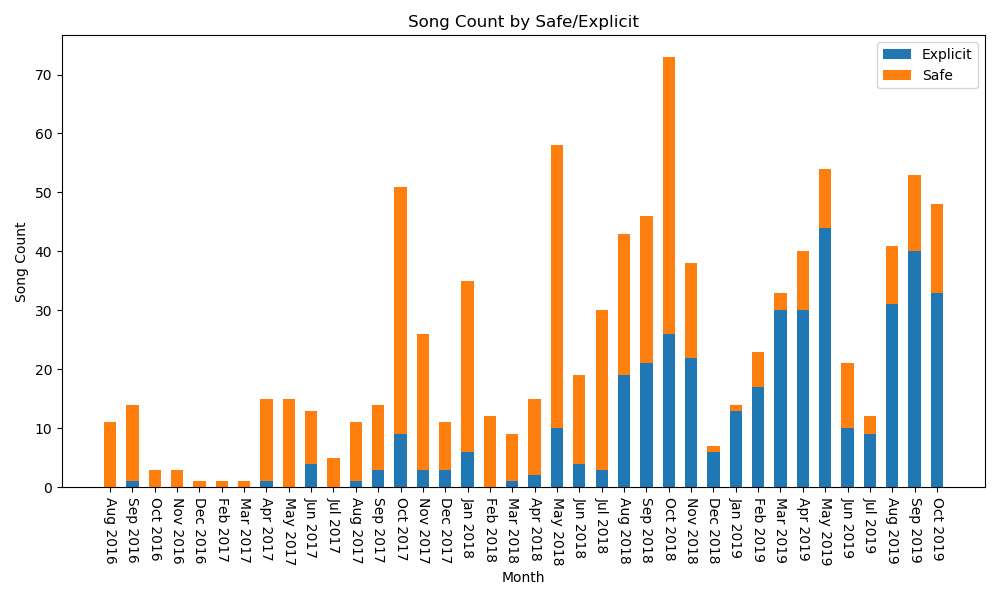

# spotify-data

## About

The purpose of this repository/project is to capture my liked songs from my Spotify account, and then create a stacked bar graph representing my explicit vs non explicit songs.

Yes, the project is super simple and doesn't have that much usefulness, but it's the first time I've genuinely used `matplotlib` or `logger` in a serious context and it was definitely interesting.

## Demonstration



```css
> python main.py
INFO:root:Pulling data from Spotify
INFO:root:Authorizing with Spotify via Spotipy
WARNING:root:May require User Interaction to authenticate properly!
INFO:root:Authorized with Spotify via Spotipy
WARNING:root:Clearing all files in tracks folder for new files
INFO:root:Cleared folder, ready to download new track files
INFO:root:Requesting 0 to 50
INFO:root:Received 0 to 50
INFO:root:Saved at "\tracks\saved-tracks-0-50.json" (150K)
INFO:root:Requesting 50 to 100
INFO:root:Received 50 to 100
INFO:root:Saved at "\tracks\saved-tracks-50-100.json" (151K)
INFO:root:Requesting 100 to 150
INFO:root:Received 100 to 150
INFO:root:Saved at "\tracks\saved-tracks-100-150.json" (146K)
INFO:root:Requesting 150 to 200
INFO:root:Received 150 to 200
INFO:root:Saved at "\tracks\saved-tracks-150-200.json" (147K)
...............................................................
INFO:root:Requesting 850 to 900
INFO:root:Received 850 to 900
INFO:root:Saved at "\tracks\saved-tracks-850-900.json" (143K)
INFO:root:Requesting 900 to 950
INFO:root:Received 900 to 919
INFO:root:Saved at "\tracks\saved-tracks-900-919.json" (55K)
INFO:root:Requested and saved 919 tracks split over 19 files (2 MB)
INFO:root:Reading track files
INFO:root:Read and parse 19 track files
INFO:root:Combining into single track file for ease of access
INFO:root:File combined with 919 items
INFO:root:Processing file...
INFO:root:Processed data, creating plot from data
INFO:root:Saving the figure to the 'export' folder
INFO:root:Showing plot to User
INFO:root:Done
>
```

# Requirements

The requirements for this project are outlined in the [requirements.txt](requirements.txt) file.

You can use the `pip` tool to instantly download and install all required modules via `pip install -r requirements.txt`.

## License

This project uses the GNU General Public License, see the [LICENSE](./LICENSE) file for more information.